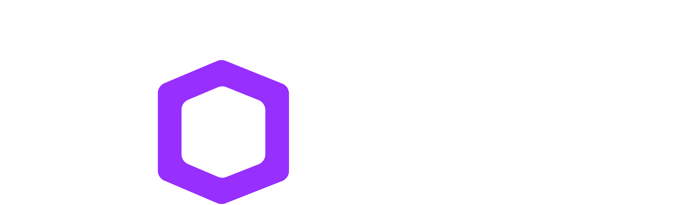

<div align="center">



### Turn one phone video of any space into a web‑ready 3D Gaussian Splat.

**No rig. No LiDAR. No app.** A casual walk‑through clip in — a photoreal, explorable 3D world out,
streaming in the browser. Built for *see‑the‑view‑before‑you‑book* experiences.

</div>

---

Portal is a **video → 3D Gaussian Splat** service. You shoot a normal phone video (up to **4K**);
Portal reconstructs camera poses, optimizes a Gaussian Splat, and serves a compressed splat that
renders in any browser — plus a per‑seat point‑of‑view layer ("see the view from seat J12 before
you book").

The reconstruction is our own orchestration of best‑in‑class open tools; the API, serverless
worker, evaluation harness, web viewer, and seat‑POV layer are ours. 

## What is a Gaussian Splat?

A **3D Gaussian Splat** represents a scene as **millions of tiny, fuzzy, coloured 3D ellipsoids** —
"Gaussians" — instead of a mesh or a neural network. Each Gaussian has four things:

| Property | What it is |
|---|---|
| **Position** `(x, y, z)` | where the blob sits in 3D space |
| **Covariance** (scale + rotation) | its size, stretch and orientation — a squashed ellipsoid |
| **Colour** (spherical harmonics) | colour that *changes with viewing angle* → real sheen, glints, reflections |
| **Opacity** `α` | how solid vs. see‑through it is; thousands overlap to build a surface |

A **differentiable rasterizer** "splats" these ellipsoids onto the screen, and **gradient descent**
nudges every one — position, shape, colour, opacity — until the rendered image matches your input
photos. Because it's just blobs (no topology), it captures **soft, complex things — fabric, foliage,
glass, hair — that meshes choke on**, and it renders in **real time, in a browser**.

- **3D Gaussian Splatting (3DGS):** the base method — Kerbl et al., SIGGRAPH 2023.
- **MCMC training (ours):** we grow the Gaussians with a *fixed budget* (so the file size stays
  web‑streamable) and relocate dead Gaussians to high‑error regions → far fewer floaters than vanilla
  3DGS. (Kheradmand et al., NeurIPS 2024.)
- **Spherical harmonics (SH):** the colour encoding that makes a glossy seat or a backlit screen look
  right from every angle — we keep **SH3** end‑to‑end so it survives export to `.ply`/`.ksplat`.

> In short: a photo tells you *what a point looks like from one place*; a Gaussian Splat learns *what
> every point looks like from everywhere*, so you can walk around inside it.

## Pipeline

```
 video (≤4K)
   │  ffmpeg — uniform frames, downscale long side ≤1920
   ▼
 frames/
   │  hloc  — eigenplaces retrieval + ALIKED features + LightGlue matcher
   │  GLOMAP — global Structure‑from‑Motion (poses + sparse cloud, gravity‑aligned)
   ▼
 sparse/0  (cameras · images · points3D)
   │  gsplat — MCMC, fixed Gaussian budget, bilateral‑grid exposure correction (SH3)
   ▼
 splat.ply
   │  prune low‑opacity floaters → compress to .ksplat (~3×, SH preserved)
   ▼
 splat.ksplat  +  quality_report.json   → browser viewer / seat‑POV
```

> **hloc** decides *which points are the same across photos*; **GLOMAP** turns those into camera
> poses and a 3D skeleton; **gsplat** fills it in. One call:
> `python -m portal --video venue.mp4 --out out/venue`.

## Repository layout

| Path | What |
|------|------|
| **`portal/`** | the pipeline package — `frames · sfm · train · export · pipeline` (our code) |
| **`worker/`** | RunPod **Serverless** GPU handler + Dockerfile (builds GLOMAP/gsplat/hloc) |
| **`api/`** | FastAPI backend — presigned upload, submit job, poll status, seat presets |
| **`web/`** | browser splat viewer + seat‑POV picker (see [`../portal-fe`](../portal-fe)) |
| **`scripts/`** | `export_ply.py`, `ply2ksplat.mjs`, `keyframe_select.py` |
| **`assets/`** | local input videos + output splats (git‑ignored) |

## Quickstart

```bash
pip install -e .
python -m portal --video venue.mp4 --out out/venue          # → out/venue/ply/splat.{ply,ksplat}
```

**Serve it (API + serverless GPU):**
```bash
cp .env.example .env                      # S3/R2 creds + RUNPOD_API_KEY + ENDPOINT_ID
docker build -f worker/Dockerfile --build-arg TORCH_CUDA_ARCH_LIST="8.9" -t $REG/portal-worker:0.2 .
docker push $REG/portal-worker:0.2        # → create a RunPod Serverless endpoint from this image
cd api && pip install -r requirements.txt && uvicorn main:app --reload
```

## Results

On a well‑captured 4K clip, Portal's output **beats KIRI Engine** (the leading commercial scanner)
on the same footage — sharper text, truer colour, cleaner geometry. 

1. **Dense uniform frames** (not motion‑gated) → no SfM fragmentation.
2. **Learned matching + global SfM** (ALIKED+LightGlue → GLOMAP) → loop‑robust poses.
3. **Bilateral‑grid exposure correction** that bakes into SH (not an appearance MLP) → exportable,
   truer colour.

Every scene emits a **`quality_report.json`** (cameras registered, points, Gaussian count, timings) —
the basis of the `eval/` harness (held‑out PSNR/SSIM/LPIPS).

## Key decisions

- **GLOMAP** for SfM (global, loop‑robust, ~10× faster than incremental).
- **MCMC** training — fixed Gaussian budget → bounded, web‑streamable file size.
- **Object storage (R2/S3)** for videos + splats; never base64 a video through the job queue.
- Splats served as compressed **`.ksplat`** (SH preserved), never raw `.ply`.

> **QA gotcha:** macOS Preview/QuickLook **cannot** render Gaussian‑splat `.ply` (it shows a flat
> point cloud). Inspect every splat in [SuperSplat](https://superspl.at/editor) or the web viewer.

## Roadmap

- [ ] **Benchmark vs. published methods (the headline TODO).** So far we've only compared against
  KIRI Engine on our own captures. Run held‑out **PSNR / SSIM / LPIPS** on the *standard* datasets —
  **Mip‑NeRF360, Tanks & Temples, Deep Blending** — and put Portal on the same table as **3DGS,
  Mip‑Splatting, Scaffold‑GS, 2DGS**. That's what turns "beats KIRI" into a defensible, quotable
  result. (And gives us a name for the method — *not* "anysplat" 😄, that one's taken.)
- [ ] **Capture‑robustness study** — span the hard axes (featureless walls, glass/reflective,
  low‑parallax, linear street‑view, seat‑POV venue), one scene per axis, each with a baseline.
- [ ] **2DGS / depth prior** for flat surfaces (floors, walls, ceilings) → less smear.
- [ ] **Seat‑POV coordinate calibration** (AprilTag) + per‑venue seat → camera presets.
- [ ] **Technical report → arXiv** (then CVPR/3DV if it holds up).

## Citing

See [CITATION.cff](CITATION.cff). A technical report is in preparation.
